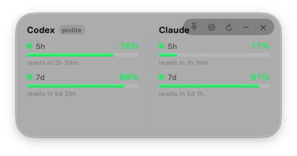
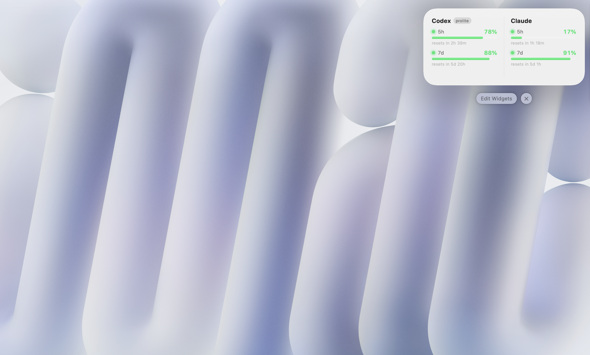
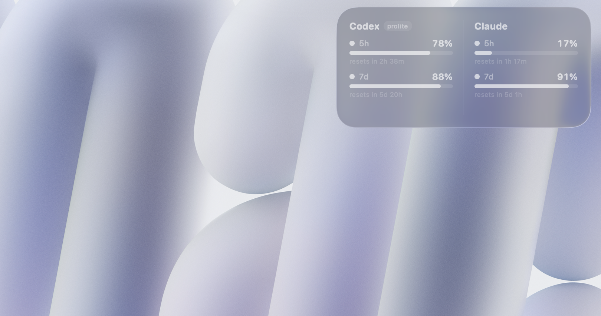
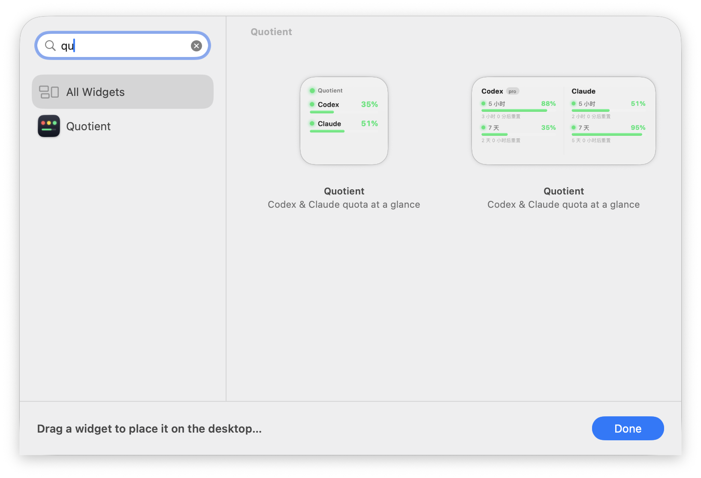

# Quotient

**简体中文** · [English](README.en.md)

macOS 桌面小组件，用红 / 黄 / 绿 LED 实时显示本机 **Codex**、**Claude Code** 和 **Gemini** 的剩余额度，不用打开命令行就能一眼看到。同屏最多显示两个服务，可在设置里自由组合。

## 截图

**液态玻璃悬浮窗**——可置顶、可拖动，悬停浮现控制按钮（置顶 / 设置 / 刷新 / 隐藏 / 退出）：



**系统原生桌面小组件**——和日历、天气一样放在桌面上，全彩模式下 LED 与进度条按额度着色：



桌面**单色（frosted）模式**下自动切换为不透明度对比方案，进度条依然清晰可读：



**组件画廊**——右键桌面 →「编辑小组件」→ 搜索 "Quotient"，提供小、中两种尺寸：



## 功能

- 🟢 **红绿灯额度状态**：剩余 ≥ 10% 绿灯；0 < 剩余 < 10% 黄灯；剩余 0 红灯。
- 🪟 **液态玻璃悬浮窗**：macOS 26 原生 Liquid Glass（`glassEffect`）材质，与系统组件一致的双栏布局与圆角，可拖动、位置自动记忆。
- 📌 **置顶 / 隐藏**：图钉按钮切换置顶；➖ 按钮隐藏悬浮窗，从菜单栏 LED 圆点菜单随时恢复（圆点颜色即总体额度状态）。
- ⚙️ **标准菜单与设置**：菜单栏菜单含「关于 Quotient」（标准 About 面板：版本号、作者 Zhi Luo、由 Claude Code 协助完成）与「设置…」。设置项：
  - **显示服务**（最多两个）：仅 Codex / 仅 Claude / 仅 Gemini，或 Codex+Claude / Codex+Gemini / Claude+Gemini，同时作用于悬浮窗和桌面小组件；
  - **语言**：跟随系统（默认）/ 简体中文 / English。
- 🔄 **自动刷新**：Codex 每分钟读取本地数据，Claude / Gemini 每 5 分钟请求一次；到额度重置时间点自动再刷新，已过重置时间的窗口直接显示为 100%。Claude / Gemini 的 access token 过期时用本地 refresh token 静默续期（无需重新登录）；断网时保留上次结果并标注数据时间。
- 🔐 **隐私友好**：
  - **Codex** 额度来自本地 `~/.codex/sessions/**/rollout-*.jsonl` 里 CLI 自己记录的 `rate_limits` 快照，**完全离线**，不读取 `auth.json`。
  - **Claude** 额度使用 Claude Code 已有的登录态（钥匙串 `Claude Code-credentials` 或 `~/.claude/.credentials.json`），调用 Anthropic 官方 `api.anthropic.com/api/oauth/usage` 接口。
  - **Gemini** 额度复用 Gemini CLI 的登录态（`~/.gemini/oauth_creds.json`），调用 Code Assist 的 `retrieveUserQuota` 接口（与 Gemini CLI `/status` 同源），显示各模型（Pro / Flash / Flash-Lite）剩余比例。
  - 三者的 token 都只在内存中用于额度请求与续期，续期后写回各自原存储位置与对应 CLI 同步，**不保存到别处、不展示、不发往任何第三方**。

## 两种显示形态

1. **液态玻璃悬浮窗**（宿主 App 自带）：可置顶、分钟级刷新、悬停浮现控制按钮。
2. **系统桌面小组件**（WidgetKit 扩展）：右键桌面 →「编辑小组件」→ 搜索 "Quotient"，提供小、中两种尺寸，桌面与通知中心均可放置。桌面单色（monochrome）渲染模式下进度条自动切换为不透明度对比方案。

数据由宿主 App 统一获取，写入 App Group 共享容器（`snapshot.json`，只含百分比与重置时间，不含任何凭据），随后通知系统刷新小组件。宿主 App 在运行时小组件近实时；宿主退出后按系统预算（约 15 分钟）自行刷新，并在重置时间点自动翻绿。建议把宿主 App 设为登录项。

## 构建与发布

需要 macOS 15+、Xcode、XcodeGen（`brew install xcodegen`）以及一张 Apple Development 签名证书（Widget 扩展必须真实签名；Team ID 写在 `project.yml` 与 `Snapshot.swift` 的 App Group ID 中，注意 Team ID 是证书 OU 字段，不是证书名称括号里的串；克隆构建时请替换为你自己的 Team ID）。Liquid Glass 效果需要 macOS 26。

```sh
./build.sh                # 构建 dist/Quotient.app 并打包 dist/Quotient-1.0.0.zip
./Scripts/make_icon.sh    # （可选）重新生成 Resources/AppIcon.icns
open dist/Quotient.app
```

应用以无 Dock 图标形态运行（菜单栏有 LED 圆点菜单），退出走菜单或悬浮窗 ✕。首次启动后系统才会把小组件登记进组件画廊。

> 分发说明：当前用 Apple Development 证书签名，仅限本机/同开发者设备运行。要公开分发需要付费开发者账号的 Developer ID 证书 + 公证（notarization），把 `project.yml` 里的 `CODE_SIGN_IDENTITY` 换成 `Developer ID Application` 并执行 `xcrun notarytool` 即可。

## 致谢

本项目受 [xicunwus2025-sys/codex-led-widget](https://github.com/xicunwus2025-sys/codex-led-widget) 启发而来——红绿灯式额度指示的创意来自该项目。

## 许可

[MIT](LICENSE) © 2026 Zhi Luo

## 工程结构

```
Sources/
  Shared/   数据模型、双语文案、Codex/Claude/Gemini 读取器、共享渲染视图、快照
  App/      悬浮窗宿主（NSPanel + 菜单栏菜单 + 设置窗口 + 刷新调度）
  Widget/   WidgetKit 扩展（TimelineProvider + 小/中尺寸视图）
Scripts/    图标生成脚本
Resources/  AppIcon.icns
project.yml XcodeGen 工程定义（双 target、entitlements、App Group）
```
